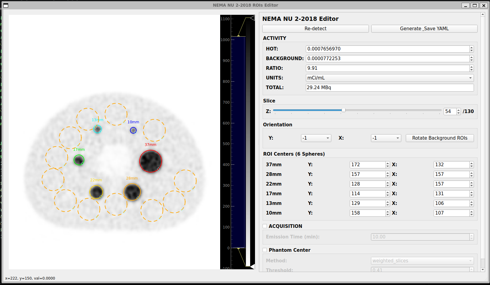
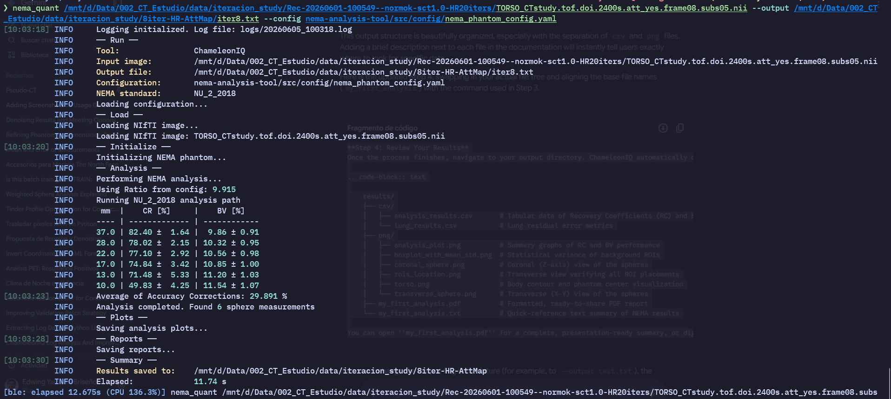
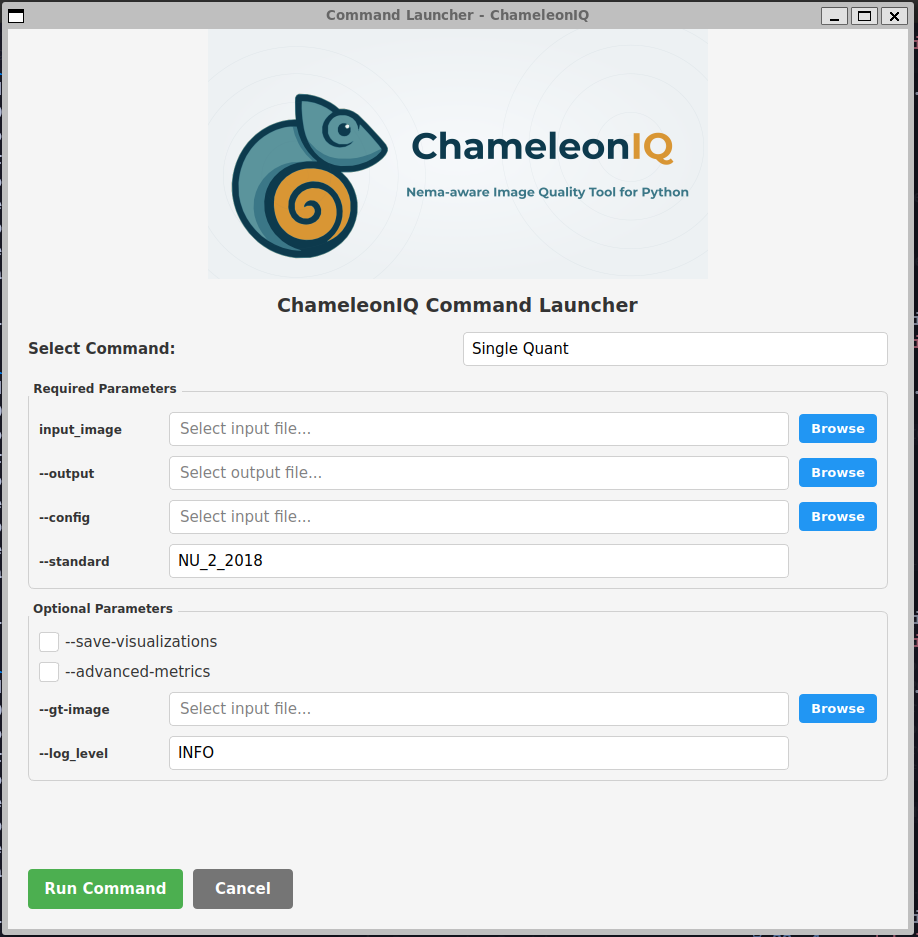

Getting Started
===============

What You Need
-------------

- Python 3.11+
- A PET reconstruction in NIfTI format (``.nii`` or ``.nii.gz``)
- Scanner parameters (voxel spacing, acquisition time)
- Phantom activity concentrations

Quick Installation
------------------

Install ChameleonIQ using pip::

    pip install ChameleonIQ

Verify Installation
~~~~~~~~~~~~~~~~~~~

Test your installation by running::

    chameleoniq_quant --help

Your First Analysis: A Visual Guide
-----------------------------------

Follow these three steps to go from a raw NIfTI image to your final NEMA report.

**Step 1: Launch the Interactive ROI Detector**
First, point the framework to your emission image. This command opens the visual editor so you can verify your phantom's positioning before running the math.

.. code-block:: bash

    chameleoniq_roi_detector /mnt/d/Data/002_CT_Estudio/data/002_Medidas_La_FE_GEMINI/000_nii/PET/140kV_150mA.nii

**Step 2: Verify & Generate Configuration**
The GUI will appear. The display automatically caps the maximum intensity at the 97th percentile, ensuring the spheres remain clearly visible without being washed out by image outliers. Verify the placement (keeping in mind the smallest sphere is precisely 4.5 mm to match the physical geometry), and click **"Generate_Save YAML"** to save your ``config.yaml``.

   The interactive NEMA NU 2-2018 Editor. Adjust your activity concentrations and visually confirm sphere placements before saving.

**Step 3: Run the Quantification Pipeline**
With your ``config.yaml`` ready, execute the main quantification command.

*Important note on outputs:* The path you provide to the ``--output`` flag determines where **all** your results will be saved. The framework will use this location to generate your text report, PDF summary, and the visualizations folder.

.. code-block:: bash

    chameleoniq_quant /mnt/d/Data/002_CT_Estudio/data/002_Medidas_La_FE_GEMINI/000_nii/PET/140kV_150mA.nii --config config.yaml --output results/my_first_analysis.txt

   The terminal will display the calculation progress and confirm when the analysis is complete.

**Step 4: Review Your Results**
Once the process finishes, navigate to your output directory. ChameleonIQ automatically organizes your results, separating the raw data, visual verification plots, and final reports:

.. code-block:: text

    results/
    ├── csv/
    │   ├── analysis_results.csv       # Tabular data of Recovery Coefficients (RC) and Background Variability (BV)
    │   └── lung_results.csv           # Lung residual error metrics
    ├── png/
    │   ├── analysis_plot.png          # Summary graphs of RC and BV performance
    │   ├── boxplot_with_mean_std.png  # Statistical variance of background ROIs
    │   ├── coronal_sphere.png         # Coronal (Z-axis) view of the spheres
    │   ├── rois_location.png          # Transverse view verifying all ROI placements
    │   ├── torso.png                  # Body contour and phantom center visualization
    │   └── transverse_sphere.png      # Transverse (X-Y) view of the spheres
    ├── my_first_analysis.pdf          # Formatted, ready-to-share PDF report
    └── my_first_analysis.txt          # Quick-reference text summary of NEMA results

You can open ``my_first_analysis.pdf`` for a complete, presentation-ready summary, or dig into the ``csv/`` folder if you need to pass the raw data into another analysis script.

Alternative: The Graphical Launcher
-----------------------------------

If you prefer to avoid the command line for your routine analyses, ChameleonIQ includes a comprehensive graphical interface to run the quantification pipeline.

Simply launch the main GUI from your terminal:

.. code-block:: bash

    chameleoniq_gui

   The main graphical interface. Instead of typing paths into the terminal, you can use this window to load your emission NIfTI, select your generated ``config.yaml``, define your output directory, and run the NEMA analysis with a single click.

Python API
~~~~~~~~~~

Programmatic analysis::

    from pathlib import Path
    from config.defaults import get_cfg_defaults
    from nema_quant.io import load_nii_image
    from nema_quant.phantom import NemaPhantom
    from nema_quant.analysis import calculate_nema_metrics

    # Load configuration and image
    cfg = get_cfg_defaults()
    image_data, affine = load_nii_image(Path('image.nii.gz'), return_affine=True)

    # Extract image properties
    image_dims = image_data.shape
    voxel_spacing = (
        float(abs(affine[0, 0])),
        float(abs(affine[1, 1])),
        float(abs(affine[2, 2]))
    )

    # Initialize phantom and analyze
    phantom = NemaPhantom(cfg, image_dims, voxel_spacing)
    results, lung_results = calculate_nema_metrics(image_data, phantom, cfg)

Next Steps
----------

- **Install**: :doc:`installation` for detailed setup
- **Run**: :doc:`usage` for CLI and workflows
- **Configure**: :doc:`guides/configuration` for YAML details
- **Understand**: :doc:`guides/how_it_works` for the pipeline

Common Tasks
~~~~~~~~~~~~

.. toctree::
   :maxdepth: 1

   guides/batch_processing
